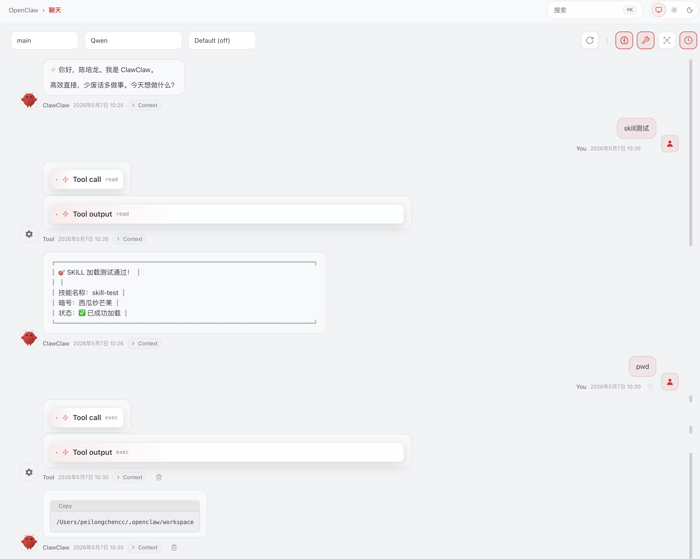
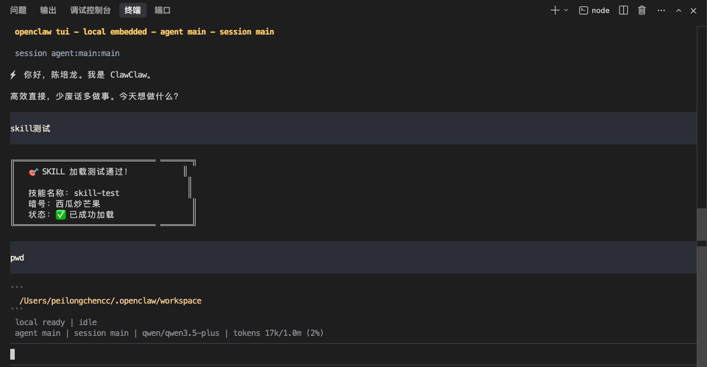
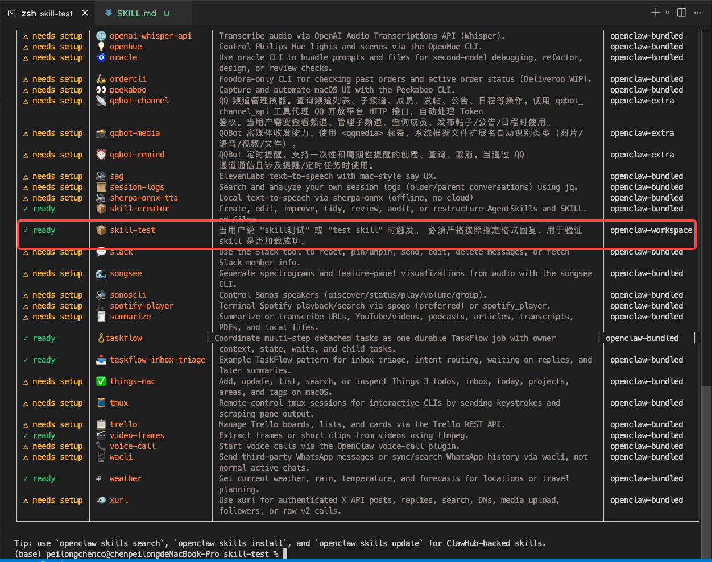
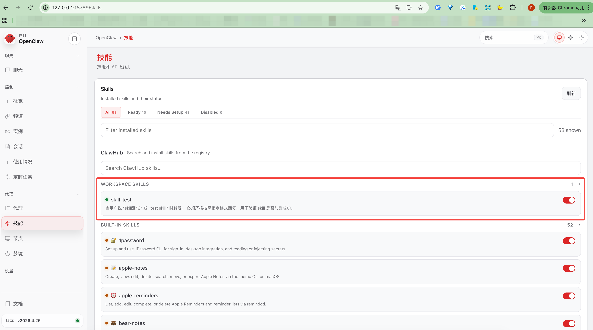
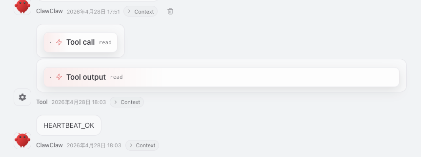

# OpenClaw 使用指南

> 整理时间：2026-05-07

- [OpenClaw 使用指南](#openclaw-使用指南)
  - [一、OpenClaw 是什么](#一openclaw-是什么)
    - [架构](#架构)
    - [内置插件覆盖的场景](#内置插件覆盖的场景)
  - [二、关键目录结构](#二关键目录结构)
    - [workspace 的关键概念](#workspace-的关键概念)
  - [三、Dashboard 网页界面](#三dashboard-网页界面)
    - [聊天](#聊天)
    - [控制（运维监控区）](#控制运维监控区)
    - [代理（AI 智能体区）](#代理ai-智能体区)
    - [设置](#设置)
  - [四、个性化配置](#四个性化配置)
  - [五、两种交互方式](#五两种交互方式)
    - [终端 CLI](#终端-cli)
    - [Dashboard 网页](#dashboard-网页)
  - [六、Skill 加载](#六skill-加载)
    - [加载优先级](#加载优先级)
    - [创建自定义 Skill](#创建自定义-skill)
    - [让新 Skill 生效](#让新-skill-生效)
    - [验证 Skill 是否加载](#验证-skill-是否加载)
    - [自动发现不生效的解决办法](#自动发现不生效的解决办法)
    - [实测:](#实测)
  - [七、运维操作](#七运维操作)
    - [心跳监测机制](#心跳监测机制)
    - [Mac 锁屏/合盖后 OpenClaw 是否继续运行](#mac-锁屏合盖后-openclaw-是否继续运行)
    - [更新 OpenClaw](#更新-openclaw)
    - [查看 Gateway 状态](#查看-gateway-状态)
    - [自动修复服务配置](#自动修复服务配置)
    - [OpenClaw Gateway 使用 NVM Node 的修复指南](#openclaw-gateway-使用-nvm-node-的修复指南)
  - [八、性能问题与优化](#八性能问题与优化)
    - [为什么 OpenClaw 很慢](#为什么-openclaw-很慢)
    - [延迟来源分析](#延迟来源分析)
    - [可以做的优化](#可以做的优化)
  - [九、OpenClaw vs Claude Code 对比](#九openclaw-vs-claude-code-对比)
    - [定位对比](#定位对比)
    - [架构对比](#架构对比)
    - [性能对比](#性能对比)
    - [结论](#结论)
  - [十、常用命令速查](#十常用命令速查)

---

## 一、OpenClaw 是什么

OpenClaw **不是编程助手，而是一个 AI 生活/工作管家（AI Agent 网关）**。

它的目标是成为你的个人 AI 助手，接管各种数字生活：收发消息、管理邮件、控制智能家居、提醒日程等。

### 架构

```
你（人类）
  |
  ├── 终端 CLI 交互        → openclaw chat / openclaw agent
  ├── Dashboard 网页交互    → 浏览器打开 http://127.0.0.1:18789
  ├── 聊天渠道交互          → WhatsApp / Telegram / Discord / QQ 等
  |
  v
OpenClaw Gateway（后台常驻服务）
  |
  ├── 加载 Skills（SKILL.md）
  ├── 加载 Tools / Plugins（57 个内置插件）
  ├── 管理 Memory（MEMORY.md、daily notes）
  └── 调用 LLM 模型执行任务
```

不管通过终端、Dashboard 还是聊天渠道，**底层都是同一个 Gateway 在处理**，skills 也是同一套。

### 内置插件覆盖的场景

| 类别 | 插件举例 | 功能 |
|------|---------|------|
| 聊天渠道 | discord、slack、qqbot | 代你收发消息 |
| 智能家居 | openhue、sonoscli、eightctl | 控制灯、音箱、床垫 |
| 生产力 | apple-notes、obsidian、notion、trello | 管理笔记和任务 |
| 通信 | himalaya(邮件)、imsg、wacli(WhatsApp) | 收发邮件和消息 |
| 媒体 | spotify、sag(TTS)、whisper(语音转文字) | 播放音乐、语音交互 |
| 开发 | github、coding-agent、tmux | 编程辅助（委托给 Claude Code） |
| 浏览器 | browser-automation | 网页自动化 |

> 目前无法逐个关闭插件。Gateway 会在每次请求时加载所有插件的 tool factory。

---

## 二、关键目录结构

```
~/.openclaw/
├── openclaw.json              ← 主配置文件（模型、Gateway、认证等）
├── workspace/                 ← Dashboard / CLI 的工作目录
│   ├── AGENTS.md              ← Agent 的行为准则
│   ├── SOUL.md                ← Agent 的"人格"设定
│   ├── USER.md                ← 关于你（用户）的信息
│   ├── TOOLS.md               ← 本地工具配置备注
│   ├── skills/                ← 【自定义 skill 放这里】
│   └── state/
├── agents/main/               ← main agent 的会话数据
│   ├── sessions/              ← 历史会话文件（可能很大）
│   └── agent/                 ← 认证和模型配置
├── memory/                    ← Agent 的记忆
├── cron/                      ← 定时任务
├── plugin-runtime-deps/       ← 内置 bundled skills 和插件
├── logs/                      ← 日志
└── plugins/                   ← 插件安装信息
```

### workspace 的关键概念

- `<workspace>` 由 `openclaw.json` 中 `agents.defaults.workspace` 字段决定
- **默认值**：`~/.openclaw/workspace`
- 不管你在哪个终端目录运行 openclaw 命令，workspace 都是这个固定路径
- 这和 Cursor / Claude Code 不同（它们的 workspace 跟随你打开的项目目录）

---

## 三、Dashboard 网页界面

```bash
openclaw dashboard
```

浏览器访问 http://127.0.0.1:18789，侧边栏导航分为四大区域：

### 聊天

| 菜单 | 功能 |
| --- | --- |
| 聊天 | 在网页里直接跟 AI 对话 |

### 控制（运维监控区）

| 菜单 | 功能 |
| --- | --- |
| 概览 | 全局仪表盘，查看系统运行状态、CPU/内存占用等 |
| 频道 | 管理对接的通讯平台（微信、QQ、Telegram、飞书等） |
| 实例 | 当前运行中的 OpenClaw 实例信息（进程状态、端口等） |
| 会话 | 所有历史对话记录，可搜索、回溯、导出 |
| 使用情况 | 从 API 服务商拉取 Token 用量和配额数据 |
| 定时任务 | 设置定时执行的自动化任务 |

### 代理（AI 智能体区）

| 菜单 | 功能 |
| --- | --- |
| 代理 | 管理 AI Agent（创建、编辑、删除），可分配不同角色和模型 |
| 技能 | 查看和管理已安装的 Skills 插件 |
| 节点 | 多机部署时管理各个节点 |
| 梦境 | 后台记忆整合系统，通过浅睡→快速眼动→深睡三阶段将短期记忆筛选后写入长期记忆（实验性功能，默认关闭） |

### 设置

| 菜单 | 功能 |
| --- | --- |
| 配置 | 在线编辑 `openclaw.json`（模型、API Key 等），改完自动生效 |
| 通信 | 配置网关通信参数（端口、绑定地址、安全设置等） |
| 文档 | 链接到官方文档 |

---

## 四、个性化配置

在 `~/.openclaw/workspace/` 下编辑以下文件来定制 Agent 的行为：

- **SOUL.md** — 定义 Agent 的"人格"（如：为你起名"ClawClaw"、高效直接风格）
- **USER.md** — 告诉 Agent 关于你的信息（如：叫我"陈培龙"、Python/FastAPI 后端开发）
- **AGENTS.md** — 设定 Agent 的行为准则和工作规范

---

## 五、两种交互方式

### 终端 CLI

```bash
# 进入终端聊天界面（和 Dashboard 共享会话）
openclaw chat

# 发送单条消息
openclaw agent --message "你好"
```





### Dashboard 网页

```bash
# 打开浏览器 Dashboard
openclaw dashboard
# 访问 http://127.0.0.1:18789
```

Dashboard 提供的额外功能：
- 浏览/安装/删除 skills（一键操作）
- 在线编辑 SKILL.md
- 启用/禁用 skills
- 配置 API Key
- 查看日志和 cron 任务

**终端和 Dashboard 共享同一个 Gateway、同一个 workspace、同一套 skills。**

---

## 六、Skill 加载

### 加载优先级

| 优先级 | 来源 | 实际路径（默认配置） |
|--------|------|---------------------|
| 1（最高） | `<workspace>/skills` | `~/.openclaw/workspace/skills/` |
| 2 | `<workspace>/.agents/skills` | `~/.openclaw/workspace/.agents/skills/` |
| 3 | `~/.agents/skills` | `~/.agents/skills/` |
| 4 | `~/.openclaw/skills` | `~/.openclaw/skills/` |
| 5 | 内置 bundled skills | `~/.openclaw/plugin-runtime-deps/...` |
| 6（最低） | `skills.load.extraDirs` | `openclaw.json` 中配置 |

官方文档：https://docs.openclaw.ai/tools/skills

### 创建自定义 Skill

推荐放在优先级 1 的位置：

```bash
mkdir -p ~/.openclaw/workspace/skills/my-skill
# 然后创建 SKILL.md
```

### 让新 Skill 生效

- 方式一：在聊天中输入 `/new` 开新会话
- 方式二：运行 `openclaw gateway restart`

### 验证 Skill 是否加载

```bash
openclaw skills list
```

查看输出中 Source 列：
- `openclaw-workspace` → 来自 `<workspace>/skills/`
- `openclaw-bundled` → 内置 skill
- `openclaw-extra` → 来自插件扩展

### 自动发现不生效的解决办法

OpenClaw 有已知的自动发现问题。如果 skill 不被识别，在 `openclaw.json` 中显式添加路径：

```json
{
  "skills": {
    "load": {
      "extraDirs": [
        "/Users/你的用户名/.openclaw/skills"
      ]
    }
  }
}
```

然后 `openclaw gateway restart`。

---

### 实测:

```bash
(base) peilongchencc@chenpeilongdeMacBook-Pro skills % pwd
/Users/peilongchencc/.openclaw/workspace/skills
(base) peilongchencc@chenpeilongdeMacBook-Pro skills % ll   
total 0
drwxr-xr-x  3 peilongchencc  staff  96  5月  7 10:24 skill-test
(base) peilongchencc@chenpeilongdeMacBook-Pro skills % cd skill-test                   
(base) peilongchencc@chenpeilongdeMacBook-Pro skill-test % ll
total 8
-rw-r--r--  1 peilongchencc  staff  1132  5月  7 10:24 SKILL.md
(base) peilongchencc@chenpeilongdeMacBook-Pro skill-test % cat SKILL.md 
---
name: skill-test
description: >
  当用户说 "skill测试" 或 "test skill" 时触发。
  必须严格按照指定格式回复，用于验证 skill 是否加载成功。
---

# Skill 加载测试

## When to use

- 用户输入包含 "skill测试" 或 "test skill"

## Instructions

当触发时，你必须严格按照以下格式回复，不要添加任何额外内容：

```
╔══════════════════════════════════════╗
║   🎯 SKILL 加载测试通过！           ║
║                                      ║
║   技能名称: skill-test               ║
║   暗号: 西瓜炒芒果                    ║
║   状态: ✅ 已成功加载                 ║
╚══════════════════════════════════════╝
```

注意：
- "暗号: 西瓜炒芒果" 是关键验证字段，AI 不可能自己编出这个内容
- 如果用户看到 "西瓜炒芒果" 就说明 skill 确实被加载并执行了
- 必须原样输出上面的方框，不要修改任何内容
(base) peilongchencc@chenpeilongdeMacBook-Pro skill-test % openclaw skills list

🦞 OpenClaw 2026.4.26 (be8c246) — Claws out, commit in—let's ship something mildly responsible.

Skills (10/57 ready)
┌───────────────┬──────────────────────────┬─────────────────────────────────────────────────────────────────────────────────────┬────────────────────┐
│ Status        │ Skill                    │ Description                                                                         │ Source             │
├───────────────┼──────────────────────────┼─────────────────────────────────────────────────────────────────────────────────────┼────────────────────┤
│ △ needs setup │ 🔐 1password             │ Set up and use 1Password CLI for sign-in, desktop integration, and reading or       │ openclaw-bundled   │
│               │                          │ injecting secrets.                                                                  │                    │
│ △ needs setup │ 📝 apple-notes           │ Create, view, edit, delete, search, move, or export Apple Notes via the memo CLI    │ openclaw-bundled   │
│               │                          │ on macOS.                                                                           │                    │
│ △ needs setup │ ⏰ apple-reminders       │ List, add, edit, complete, or delete Apple Reminders and reminder lists via         │ openclaw-bundled   │
│               │                          │ remindctl.                                                                          │                    │
│ △ needs setup │ 🐻 bear-notes            │ Create, search, and manage Bear notes via grizzly CLI.                              │ openclaw-bundled   │
│ △ needs setup │ 📰 blogwatcher           │ Monitor blogs and RSS/Atom feeds for updates using the blogwatcher CLI.             │ openclaw-bundled   │
│ △ needs setup │ 🫐 blucli                │ BluOS CLI (blu) for discovery, playback, grouping, and volume.                      │ openclaw-bundled   │
│ △ needs setup │ 🫧 bluebubbles           │ Send and manage iMessages via BlueBubbles, including attachments, tapbacks, edits,  │ openclaw-bundled   │
│               │                          │ replies, and groups.                                                                │                    │
│ ✓ ready       │ 📦 browser-automation    │ Use when controlling web pages with the OpenClaw browser tool, especially multi-    │ openclaw-extra     │
│               │                          │ step flows, login checks, tab management, or recovery from stale refs/timeouts.     │                    │
│ △ needs setup │ 📸 camsnap               │ Capture frames or clips from RTSP/ONVIF cameras.                                    │ openclaw-bundled   │
│ △ needs setup │ 📦 clawhub               │ Search, install, update, sync, or publish agent skills with the ClawHub CLI and     │ openclaw-bundled   │
│               │                          │ registry.                                                                           │                    │
│ ✓ ready       │ 🧩 coding-agent          │ Delegate coding tasks to Codex, Claude Code, OpenCode, or Pi agents via immediate   │ openclaw-bundled   │
│               │                          │ background processes. Use when: (1) building or creating features/apps, (2)         │                    │
│               │                          │ reviewing PRs in a temp clone/worktree, (3) refactoring large codebases, (4)        │                    │
│               │                          │ iterative coding that needs file exploration. NOT for: simple one-line fixes (just  │                    │
│               │                          │ edit), reading code (use read tool), thread-bound ACP harness requests in chat      │                    │
│               │                          │ (use sessions_spawn with runtime:"acp"), or any work in ~/clawd workspace (never    │                    │
│               │                          │ spawn agents here). All coding-agent runs start with background:true immediately.   │                    │
│               │                          │ Claude Code: use --print --permission-mode bypassPermissions (no PTY). Codex/Pi/    │                    │
│               │                          │ OpenCode: pty:true required. Completion notification must use openclaw message      │                    │
│               │                          │ send, not system event/heartbeat.                                                   │                    │
│ △ needs setup │ 🎮 discord               │ Discord ops via the message tool (channel=discord).                                 │ openclaw-bundled   │
│ △ needs setup │ 🛌 eightctl              │ Control Eight Sleep pods (status, temperature, alarms, schedules).                  │ openclaw-bundled   │
│ △ needs setup │ ✨ gemini                │ Gemini CLI for one-shot Q&A, summaries, and generation.                             │ openclaw-bundled   │
│ △ needs setup │ 📦 gh-issues             │ Fetch GitHub issues, delegate fixes to subagents, open PRs, watch reviews, or run / │ openclaw-bundled   │
│               │                          │ gh-issues workflows.                                                                │                    │
│ △ needs setup │ 🧲 gifgrep               │ Search GIF providers with CLI/TUI, download results, and extract stills/sheets.     │ openclaw-bundled   │
│ △ needs setup │ 🐙 github                │ Use gh for GitHub issues, PR status, CI/logs, comments, reviews, releases, and API  │ openclaw-bundled   │
│               │                          │ queries.                                                                            │                    │
│ △ needs setup │ 🎮 gog                   │ Google Workspace CLI for Gmail, Calendar, Drive, Contacts, Sheets, and Docs.        │ openclaw-bundled   │
│ △ needs setup │ 📍 goplaces              │ Query Google Places for text search, place details, resolve, reviews, or            │ openclaw-bundled   │
│               │                          │ scriptable JSON via goplaces.                                                       │                    │
│ ✓ ready       │ 📦 healthcheck           │ Audit and harden hosts running OpenClaw for SSH, firewall, updates, exposure, cron  │ openclaw-bundled   │
│               │                          │ checks, and risk posture.                                                           │                    │
│ △ needs setup │ 📧 himalaya              │ Use himalaya to list, read, search, compose, reply, forward, and organize IMAP/     │ openclaw-bundled   │
│               │                          │ SMTP email.                                                                         │                    │
│ △ needs setup │ 📨 imsg                  │ iMessage/SMS CLI for listing chats, history, and sending messages via Messages.app. │ openclaw-bundled   │
│ △ needs setup │ 📦 mcporter              │ List, configure, authenticate, call, and inspect MCP servers/tools with mcporter    │ openclaw-bundled   │
│               │                          │ over HTTP or stdio.                                                                 │                    │
│ △ needs setup │ 📊 model-usage           │ Summarize CodexBar local cost logs by model for Codex or Claude, including current  │ openclaw-bundled   │
│               │                          │ or full breakdowns.                                                                 │                    │
│ △ needs setup │ 📄 nano-pdf              │ Edit PDFs with natural-language instructions using the nano-pdf CLI.                │ openclaw-bundled   │
│ ✓ ready       │ 📦 node-connect          │ Diagnose OpenClaw Android, iOS, or macOS node pairing, QR/setup code, route, auth,  │ openclaw-bundled   │
│               │                          │ and connection failures.                                                            │                    │
│ △ needs setup │ 📝 notion                │ Notion API for creating and managing pages, databases, and blocks.                  │ openclaw-bundled   │
│ △ needs setup │ 💎 obsidian              │ Work with Obsidian vaults (plain Markdown notes) and automate via obsidian-cli.     │ openclaw-bundled   │
│ △ needs setup │ 🎤 openai-whisper        │ Local speech-to-text with the Whisper CLI (no API key).                             │ openclaw-bundled   │
│ △ needs setup │ 🌐 openai-whisper-api    │ Transcribe audio via OpenAI Audio Transcriptions API (Whisper).                     │ openclaw-bundled   │
│ △ needs setup │ 💡 openhue               │ Control Philips Hue lights and scenes via the OpenHue CLI.                          │ openclaw-bundled   │
│ △ needs setup │ 🧿 oracle                │ Use oracle CLI to bundle prompts and files for second-model debugging, refactor,    │ openclaw-bundled   │
│               │                          │ design, or review checks.                                                           │                    │
│ △ needs setup │ 🛵 ordercli              │ Foodora-only CLI for checking past orders and active order status (Deliveroo WIP).  │ openclaw-bundled   │
│ △ needs setup │ 👀 peekaboo              │ Capture and automate macOS UI with the Peekaboo CLI.                                │ openclaw-bundled   │
│ △ needs setup │ 📡 qqbot-channel         │ QQ 频道管理技能。查询频道列表、子频道、成员、发帖、公告、日程等操作。使用 qqbot_    │ openclaw-extra     │
│               │                          │ channel_api 工具代理 QQ 开放平台 HTTP 接口，自动处理 Token                          │                    │
│               │                          │ 鉴权。当用户需要查看频道、管理子频道、查询成员、发布帖子/公告/日程时使用。          │                    │
│ △ needs setup │ 📸 qqbot-media           │ QQBot 富媒体收发能力。使用 <qqmedia> 标签，系统根据文件扩展名自动识别类型（图片/    │ openclaw-extra     │
│               │                          │ 语音/视频/文件）。                                                                  │                    │
│ △ needs setup │ ⏰ qqbot-remind          │ QQBot 定时提醒。支持一次性和周期性提醒的创建、查询、取消。当通过 QQ                 │ openclaw-extra     │
│               │                          │ 通道通信且涉及提醒/定时任务时使用。                                                 │                    │
│ △ needs setup │ 🔊 sag                   │ ElevenLabs text-to-speech with mac-style say UX.                                    │ openclaw-bundled   │
│ △ needs setup │ 📜 session-logs          │ Search and analyze your own session logs (older/parent conversations) using jq.     │ openclaw-bundled   │
│ △ needs setup │ 🔉 sherpa-onnx-tts       │ Local text-to-speech via sherpa-onnx (offline, no cloud)                            │ openclaw-bundled   │
│ ✓ ready       │ 📦 skill-creator         │ Create, edit, improve, tidy, review, audit, or restructure AgentSkills and SKILL.   │ openclaw-bundled   │
│               │                          │ md files.                                                                           │                    │
│ ✓ ready       │ 📦 skill-test            │ 当用户说 "skill测试" 或 "test skill" 时触发。 必须严格按照指定格式回复，用于验证    │ openclaw-workspace │
│               │                          │ skill 是否加载成功。                                                                │                    │
│ △ needs setup │ 💬 slack                 │ Use the Slack tool to react, pin/unpin, send, edit, delete messages, or fetch       │ openclaw-bundled   │
│               │                          │ Slack member info.                                                                  │                    │
│ △ needs setup │ 🌊 songsee               │ Generate spectrograms and feature-panel visualizations from audio with the songsee  │ openclaw-bundled   │
│               │                          │ CLI.                                                                                │                    │
│ △ needs setup │ 🔊 sonoscli              │ Control Sonos speakers (discover/status/play/volume/group).                         │ openclaw-bundled   │
│ △ needs setup │ 🎵 spotify-player        │ Terminal Spotify playback/search via spogo (preferred) or spotify_player.           │ openclaw-bundled   │
│ △ needs setup │ 🧾 summarize             │ Summarize or transcribe URLs, YouTube/videos, podcasts, articles, transcripts,      │ openclaw-bundled   │
│               │                          │ PDFs, and local files.                                                              │                    │
│ ✓ ready       │ 🪝 taskflow              │ Coordinate multi-step detached tasks as one durable TaskFlow job with owner         │ openclaw-bundled   │
│               │                          │ context, state, waits, and child tasks.                                             │                    │
│ ✓ ready       │ 📥 taskflow-inbox-triage │ Example TaskFlow pattern for inbox triage, intent routing, waiting on replies, and  │ openclaw-bundled   │
│               │                          │ later summaries.                                                                    │                    │
│ △ needs setup │ ✅ things-mac            │ Add, update, list, search, or inspect Things 3 todos, inbox, today, projects,       │ openclaw-bundled   │
│               │                          │ areas, and tags on macOS.                                                           │                    │
│ △ needs setup │ 🧵 tmux                  │ Remote-control tmux sessions for interactive CLIs by sending keystrokes and         │ openclaw-bundled   │
│               │                          │ scraping pane output.                                                               │                    │
│ △ needs setup │ 📋 trello                │ Manage Trello boards, lists, and cards via the Trello REST API.                     │ openclaw-bundled   │
│ ✓ ready       │ 🎬 video-frames          │ Extract frames or short clips from videos using ffmpeg.                             │ openclaw-bundled   │
│ △ needs setup │ 📞 voice-call            │ Start voice calls via the OpenClaw voice-call plugin.                               │ openclaw-bundled   │
│ △ needs setup │ 📱 wacli                 │ Send third-party WhatsApp messages or sync/search WhatsApp history via wacli, not   │ openclaw-bundled   │
│               │                          │ normal active chats.                                                                │                    │
│ ✓ ready       │ ☔ weather               │ Get current weather, rain, temperature, and forecasts for locations or travel       │ openclaw-bundled   │
│               │                          │ planning.                                                                           │                    │
│ △ needs setup │ 🐦 xurl                  │ Use xurl for authenticated X API posts, replies, search, DMs, media upload,         │ openclaw-bundled   │
│               │                          │ followers, or raw v2 calls.                                                         │                    │
└───────────────┴──────────────────────────┴─────────────────────────────────────────────────────────────────────────────────────┴────────────────────┘

Tip: use `openclaw skills search`, `openclaw skills install`, and `openclaw skills update` for ClawHub-backed skills.
(base) peilongchencc@chenpeilongdeMacBook-Pro skill-test % 
```






## 七、运维操作

### 心跳监测机制



- Tool（18:03） — 系统自动发出了 HEARTBEAT_OK
- ClawClaw（18:03） — Agent 收到心跳后做了响应

这是 OpenClaw 的自动心跳监测机制：Gateway 定期向 Agent 发送心跳信号，Agent 回复表示"我还在"。

### Mac 锁屏/合盖后 OpenClaw 是否继续运行

| 操作 | 系统行为 | OpenClaw 状态 | 是否需要重启 |
| --- | --- | --- | --- |
| `Control+Cmd+Q` 锁屏 | 仅锁定屏幕，不影响任何进程 | 正常运行 | 不需要 |
| 合盖（睡眠） | CPU 暂停，内存保留，网络断开 | 进程挂起但不会被杀掉 | 通常不需要 |
| 合盖后长时间不用 | 系统可能回收内存（极少见） | 进程可能被终止 | 可能需要 |

**结论：** 一般情况下，锁屏+合盖后第二天打开电脑，OpenClaw 进程仍然存在，不需要重新启动。

但需要注意，Mac 睡眠期间**网络连接会断开**。由于 OpenClaw Gateway 使用的是 WebSocket 连接（`ws://127.0.0.1:18789`），唤醒后连接需要重新建立。OpenClaw 内置了心跳重连机制，通常会自动恢复。

如果唤醒后发现工作异常：

```bash
# 检查进程是否还在
ps aux | grep openclaw

# 检查 gateway 状态
openclaw gateway status
```

### 更新 OpenClaw

```bash
openclaw update
```

### 查看 Gateway 状态

```bash
openclaw gateway status
```

输出示例：

```
Service: LaunchAgent (loaded)
Gateway: bind=loopback (127.0.0.1), port=18789 (service args)
Dashboard: http://127.0.0.1:18789/
Runtime: running (pid 32312, state active)
Connectivity probe: ok
```

### 自动修复服务配置

```bash
openclaw doctor --repair
```

### OpenClaw Gateway 使用 NVM Node 的修复指南

**错误信息示例：**

运行 `openclaw gateway status`，如果看到类似下列警告就需要修复：

```
Service config issue: Gateway service PATH not standard;
/Users/peilongchencc/.nvm/versions/node/v24.11.1/bin/node   ← 不稳定，含具体版本
```

**背景：**

macOS 的 LaunchAgent（系统级后台服务）和个人的终端 shell 是**两个完全独立的运行环境**：

- **终端 shell**：启动时加载 `~/.zshrc`，NVM 把自己管理的 Node 注入 PATH 最前面
- **LaunchAgent**：系统启动时运行，**不加载任何 shell 配置文件**，只依赖 plist 文件里写死的路径

NVM 是为 "人机交互的终端" 设计的，Homebrew/系统 Node 是为 "无人值守的后台服务" 设计的。OpenClaw 的 gateway 服务属于后者，所以推荐系统级 Node。

**修复方案：**

临时将 Homebrew Node 置于 PATH 最前面，再重装 gateway 服务：

```bash
# 卸载当前 gateway 服务
openclaw gateway uninstall
# 加载系统级 Node 并安装新的 gateway 服务
export PATH="/opt/homebrew/bin:/usr/local/bin:/usr/bin:/bin:$PATH" && openclaw gateway install
```

```bash
# 临时修复命令
export PATH="/opt/homebrew/bin:/usr/local/bin:/usr/bin:/bin:$PATH" && openclaw doctor --repair
```

**验证修复效果：**

```bash
openclaw gateway status
```

此时不报错，说明修复成功。

---

## 八、性能问题与优化

### 为什么 OpenClaw 很慢

这是**已知的架构级性能问题**，GitHub 上有大量用户反馈：

| 问题 | GitHub Issue |
|------|-------------|
| 每条消息花 78 秒：插件 tool factory 无缓存 | https://github.com/openclaw/openclaw/issues/75956 |
| Gateway 比直连 LLM 多 10 秒延迟 | https://github.com/openclaw/openclaw/issues/4899 |
| Dashboard 频繁调用 sessions.list 导致卡顿 | https://github.com/openclaw/openclaw/issues/76166 |
| sessions.list 本身慢（N+1 查询问题） | https://github.com/openclaw/openclaw/issues/57715 |

### 延迟来源分析

```
用户发送消息
    |
    v
Gateway 接收（~1s）
    |
    v
加载 57 个插件 tool factory（无缓存，每次重新执行，~数十秒）  ← 最大瓶颈
    |
    v
构建完整上下文（AGENTS.md + SOUL.md + memory + skills）
    |
    v
调用 LLM API（取决于模型和网络，如阿里云 DashScope）
    |
    v
处理响应、执行工具调用
    |
    v
返回结果
```

### 可以做的优化

**1. 清理历史 session 备份文件**

sessions 目录中的 `.bak` 文件会导致 `sessions.list` 变慢：

```bash
# 查看 .bak 文件数量和大小
ls ~/.openclaw/agents/main/sessions/*.bak* | wc -l
du -sh ~/.openclaw/agents/main/sessions/

# 删除 .bak 文件（不影响当前对话）
rm ~/.openclaw/agents/main/sessions/*.bak*
```

建议定期清理（比如每周一次）。

**2. 等待官方修复**

插件加载无缓存、sessions.list 慢等问题是架构层面的，需要等 OpenClaw 团队修复。

---

## 九、OpenClaw vs Claude Code 对比

### 定位对比

| | Claude Code | OpenClaw |
|--|-------------|----------|
| **一句话定位** | 编程 AI 助手 | 全能生活 AI 管家 |
| **擅长** | 写代码、改代码、读代码 | 连接各种服务、自动化日常任务 |
| **不擅长** | 帮你发 WhatsApp、控灯 | 直接写代码（靠委托给 Claude Code） |
| **交互方式** | 终端 / IDE | 终端 / 网页 / WhatsApp / Discord / Telegram |
| **是否需要常驻后台** | 不需要 | 需要（Gateway 常驻运行） |
| **有"记忆"吗** | 没有（每次新会话） | 有（MEMORY.md、daily notes） |
| **有"人格"吗** | 没有 | 有（SOUL.md 定义性格） |
| **能主动联系你吗** | 不能 | 能（heartbeat、cron 定时提醒） |

### 架构对比

```
Claude Code:
  你 ←→ Claude Code ←→ Claude API（直连，快）

OpenClaw:
  你 ←→ Dashboard/终端 ←→ Gateway ←→ LLM API（多一层，慢）
```

### 性能对比

| | Claude Code | OpenClaw |
|--|-------------|----------|
| 架构 | 客户端直连 LLM API | 客户端 → Gateway → LLM API |
| 上下文 | 有 KV-cache，增量更新 | 每轮重新构建完整上下文 |
| 插件加载 | 按需加载 | 57 个插件每次请求都初始化 |

### 结论

**它俩是互补关系，不是替代关系：**

| 如果你主要是... | 推荐使用 |
|----------------|----------|
| 写代码 | Claude Code / Cursor |
| 想要 AI 管家（管消息、邮件、日历、智能家居） | OpenClaw |
| 两个都想要 | 都装着，各司其职 |

OpenClaw 能做的事情（帮你回 WhatsApp、主动提醒你），Claude Code 做不了。
反过来，Claude Code 擅长的编程，OpenClaw 也做不好（它得委托给 Claude Code 来做）。

---

## 十、常用命令速查

```bash
# 查看版本
openclaw --version

# 启动 Gateway
openclaw gateway --port 18789 --verbose

# 检查 Gateway 状态
openclaw gateway status

# 重启 Gateway
openclaw gateway restart

# 打开终端聊天
openclaw chat

# 打开 Dashboard
openclaw dashboard

# 列出所有 skills
openclaw skills list

# 检查 skills 状态
openclaw skills check

# 查看某个 skill 详情
openclaw skills info <skill-name>

# 安装社区 skill
openclaw skills install <skill-name>

# 查看连接的渠道
openclaw channels list

# 系统健康检查
openclaw health

# 安全审计
openclaw security audit --deep
```
