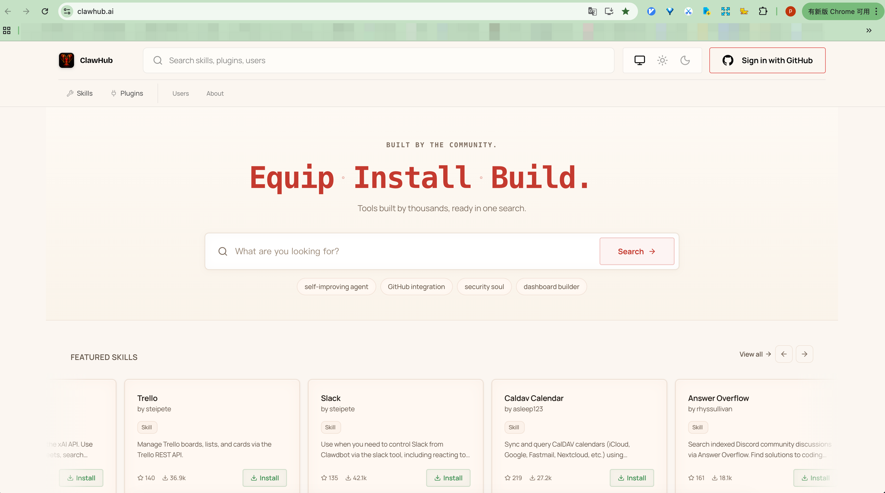

# Skills / Skills（技能）

> **原文来源 / Source:** https://docs.openclaw.ai/tools/skills

---

## 概述 / Overview

OpenClaw 使用兼容 [AgentSkills](https://agentskills.io/) 规范的技能文件夹来教导 Agent 如何使用工具。每个技能是一个包含 `SKILL.md` 文件的目录，该文件带有 YAML 前置元数据和使用说明。OpenClaw 加载内置技能以及可选的本地覆盖项，并在加载时根据环境变量、配置和可执行文件的存在情况对技能进行过滤。

---

## Locations and precedence / 加载位置与优先级

OpenClaw 从以下来源加载技能，**优先级从高到低**：

| # | Source / 来源 | Path / 路径 |
|---|---|---|
| 1 | Workspace skills / 工作区技能 | `<workspace>/skills` |
| 2 | Project agent skills / 项目 Agent 技能 | `<workspace>/.agents/skills` |
| 3 | Personal agent skills / 个人 Agent 技能 | `~/.agents/skills` |
| 4 | Managed/local skills / 托管/本地技能 | `~/.openclaw/skills` |
| 5 | Bundled skills / 内置技能 | shipped with the install / 随安装包附带 |
| 6 | Extra skill folders / 额外技能目录 | `skills.load.extraDirs`（配置项） |

若技能名称冲突，优先级最高的来源获胜。

---

## Per-agent vs shared skills / 独占技能 vs 共享技能

在**多 Agent** 设置中，每个 Agent 拥有自己的工作区：

| Scope / 范围 | Path / 路径 | Visible to / 可见范围 |
|---|---|---|
| Per-agent / 独占 Agent | `<workspace>/skills` | Only that agent / 仅该 Agent |
| Project-agent / 项目 Agent | `<workspace>/.agents/skills` | Only that workspace's agent / 仅该工作区的 Agent |
| Personal-agent / 个人 Agent | `~/.agents/skills` | All agents on that machine / 该机器上所有 Agent |
| Shared managed/local / 共享托管/本地 | `~/.openclaw/skills` | All agents on that machine / 该机器上所有 Agent |
| Shared extra dirs / 共享额外目录 | `skills.load.extraDirs`（最低优先级） | All agents on that machine / 该机器上所有 Agent |

同一名称出现在多处时 → 优先级最高的来源获胜。工作区 > 项目 Agent > 个人 Agent > 托管/本地 > 内置 > 额外目录。

---

## Agent skill allowlists / Agent 技能白名单

技能的**加载位置**和技能的**可见性**是两个独立的控制维度。位置/优先级决定同名技能中哪个副本生效；Agent 白名单决定某个 Agent 实际可以使用哪些技能。

```json5
{
  agents: {
    defaults: {
      skills: ["github", "weather"],
    },
    list: [
      { id: "writer" },              // 继承 github, weather / inherits github, weather
      { id: "docs", skills: ["docs-search"] }, // 替换默认值 / replaces defaults
      { id: "locked-down", skills: [] },       // 无技能 / no skills
    ],
  },
}
```

## ClawHub (install and sync) / ClawHub（安装与同步）

[ClawHub](https://clawhub.ai/) 是 OpenClaw 的公共技能注册表。使用原生 `openclaw skills` 命令进行发现/安装/更新，或使用独立的 `clawhub` CLI 进行发布/同步工作流。



| Action / 操作 | Command / 命令 |
|---|---|
| Install a skill into the workspace / 将技能安装到工作区 | `openclaw skills install <skill-slug>` |
| Update all installed skills / 更新所有已安装的技能 | `openclaw skills update --all` |
| Sync (scan + publish updates) / 同步（扫描+发布更新） | `clawhub sync --all` |

原生 `openclaw skills install` 安装到活跃工作区的 `skills/` 目录。独立的 `clawhub` CLI 也安装到当前工作目录的 `./skills` 下（若未找到则回退到配置的 OpenClaw 工作区）。配置的技能根目录也支持一层分组，如 `skills/<group>/<skill>/SKILL.md`，这样相关的第三方技能可以保存在共享文件夹下，而无需广泛递归扫描。

ClawHub 技能页面在安装前展示最新的安全扫描状态，包含 VirusTotal、ClawScan 和静态分析的扫描详情页。发布者可通过 ClawHub 控制台或 `clawhub skill rescan <slug>` 处理误报问题。

---

## SKILL.md 格式

`SKILL.md` 至少需要包含：

```markdown
---
name: image-lab
description: Generate or edit images via a provider-backed image workflow
---
```

OpenClaw 遵循 AgentSkills 规范进行布局/意图定义。解析器仅支持**单行**前置元数据键；`metadata` 应为**单行 JSON 对象**。在指令中使用 `{baseDir}` 来引用技能文件夹路径。

### Optional frontmatter keys / 可选前置元数据键

| Key / 键 | Type / 类型 | Description / 说明 |
|---|---|---|
| `homepage` | `string` | URL shown as "Website" in the macOS Skills UI. / 在 macOS Skills UI 中显示为"Website"的 URL。 |
| `user-invocable` | `boolean`（默认 `true`）| When `true`, the skill is exposed as a user slash command. / 为 `true` 时，技能作为用户斜线命令暴露。 |
| `disable-model-invocation` | `boolean`（默认 `false`）| When `true`, skill instructions are excluded from the agent's normal prompt. / 为 `true` 时，技能指令从 Agent 的常规提示中排除。 |
| `command-dispatch` | `"tool"` | When `tool`, the slash command bypasses the model and dispatches directly to a tool. / 为 `tool` 时，斜线命令绕过模型直接分发到工具。 |
| `command-tool` | `string` | Tool name to invoke when `command-dispatch: tool` is set. / 设置 `command-dispatch: tool` 时调用的工具名称。 |
| `command-arg-mode` | `"raw"`（默认）| Forwards the raw args string to the tool (no core parsing). / 将原始参数字符串转发给工具（不进行核心解析）。 |

---

## Gating (load-time filters) / 门控（加载时过滤）

OpenClaw 在加载时使用 `metadata`（单行 JSON）对技能进行过滤：

```markdown
---
name: image-lab
description: Generate or edit images via a provider-backed image workflow
metadata:
  {
    "openclaw":
      {
        "requires": { "bins": ["uv"], "env": ["GEMINI_API_KEY"], "config": ["browser.enabled"] },
        "primaryEnv": "GEMINI_API_KEY",
      },
  }
---
```

**Fields under `metadata.openclaw` / `metadata.openclaw` 下的字段：**

| Field / 字段 | Type / 类型 | Description / 说明 |
|---|---|---|
| `always` | `boolean` | When `true`, always include the skill (skip other gates). / 为 `true` 时，始终包含该技能（跳过其他门控）。 |
| `emoji` | `string` | Optional emoji used by the macOS Skills UI. / macOS Skills UI 使用的可选表情符号。 |
| `homepage` | `string` | Optional URL shown as "Website" in the macOS Skills UI. / 在 macOS Skills UI 中显示为"Website"的可选 URL。 |
| `os` | `"darwin" \| "linux" \| "win32"` | Optional platform list; skill is only eligible on those OSes. / 可选平台列表；技能仅在这些操作系统上生效。 |
| `requires.bins` | `string[]` | Each must exist on `PATH`. / 每个都必须存在于 `PATH`。 |
| `requires.anyBins` | `string[]` | At least one must exist on `PATH`. / 至少一个必须存在于 `PATH`。 |
| `requires.env` | `string[]` | Env var must exist or be provided in config. / 环境变量必须存在或在配置中提供。 |
| `requires.config` | `string[]` | List of `openclaw.json` paths that must be truthy. / 必须为真值的 `openclaw.json` 路径列表。 |
| `primaryEnv` | `string` | Env var name associated with `skills.entries.<name>.apiKey`. / 与 `skills.entries.<name>.apiKey` 关联的环境变量名称。 |
| `install` | `object[]` | Optional installer specs (brew/node/go/uv/download). / 可选安装器规格（brew/node/go/uv/download）。 |

If no `metadata.openclaw` is present, the skill is always eligible (unless disabled in config or blocked by `skills.allowBundled`).

若不存在 `metadata.openclaw`，则技能始终可用（除非在配置中禁用或被 `skills.allowBundled` 阻止）。

> **Note / 注意：** Legacy `metadata.clawdbot` blocks are still accepted when `metadata.openclaw` is absent. New and updated skills should use `metadata.openclaw`.
>
> 在 `metadata.openclaw` 不存在时，旧版 `metadata.clawdbot` 块仍被接受。新技能和更新后的技能应使用 `metadata.openclaw`。

### Sandboxing notes / 沙箱注意事项

- `requires.bins` is checked on the **host** at skill load time. / `requires.bins` 在技能加载时于**宿主机**上检查。
- If an agent is sandboxed, the binary must also exist **inside the container**. Install it via `agents.defaults.sandbox.docker.setupCommand` (or a custom image). `setupCommand` runs once after the container is created. / 如果 Agent 运行于沙箱中，可执行文件也必须存在于**容器内部**。通过 `agents.defaults.sandbox.docker.setupCommand`（或自定义镜像）安装。`setupCommand` 在容器创建后运行一次。
- Example: the `summarize` skill needs the `summarize` CLI in the sandbox container to run there. / 示例：`summarize` 技能需要沙箱容器中存在 `summarize` CLI 才能在其中运行。

### Installer specs / 安装器规格示例

```markdown
---
name: gemini
description: Use Gemini CLI for coding assistance and Google search lookups.
metadata:
  {
    "openclaw":
      {
        "emoji": "♊️",
        "requires": { "bins": ["gemini"] },
        "install":
          [
            {
              "id": "brew",
              "kind": "brew",
              "formula": "gemini-cli",
              "bins": ["gemini"],
              "label": "Install Gemini CLI (brew)",
            },
          ],
      },
  }
---
```

**Installer selection rules / 安装器选择规则：**

- If multiple installers are listed, the gateway picks a single preferred option (brew when available, otherwise node). / 若列出多个安装器，Gateway 选择单个首选项（优先 brew，否则选 node）。
- If all installers are `download`, OpenClaw lists each entry so you can see the available artifacts. / 若所有安装器均为 `download`，OpenClaw 列出每个条目以查看可用构件。
- Installer specs can include `os: ["darwin"|"linux"|"win32"]` to filter options by platform. / 安装器规格可包含 `os: ["darwin"|"linux"|"win32"]` 按平台过滤选项。
- Node installs honor `skills.install.nodeManager` in `openclaw.json` (default: npm; options: npm/pnpm/yarn/bun). / Node 安装遵循 `openclaw.json` 中的 `skills.install.nodeManager`（默认：npm；选项：npm/pnpm/yarn/bun）。
- Gateway-backed installer selection prefers Homebrew when `skills.install.preferBrew` is enabled and `brew` exists, then `uv`, then the configured node manager, then other fallbacks. / Gateway 安装器选择在启用 `skills.install.preferBrew` 且 `brew` 存在时优先 Homebrew，其次 `uv`，再次配置的 node 管理器，最后其他回退选项。

**Per-installer details / 各安装器详情：**

- **Go installs:** if `go` is missing and `brew` is available, the gateway installs Go via Homebrew first and sets `GOBIN` to Homebrew's `bin` when possible. / **Go 安装：** 若 `go` 不存在且 `brew` 可用，Gateway 优先通过 Homebrew 安装 Go，并在可能时将 `GOBIN` 设置为 Homebrew 的 `bin`。
- **Download installs:** `url`（必填）、`archive`（`tar.gz` | `tar.bz2` | `zip`）、`extract`（默认：检测到存档时自动）、`stripComponents`、`targetDir`（默认：`~/.openclaw/tools/<skillKey>`）。/ **下载安装：** `url`（required）, `archive` (`tar.gz` | `tar.bz2` | `zip`), `extract` (default: auto when archive detected), `stripComponents`, `targetDir` (default: `~/.openclaw/tools/<skillKey>`).

---

## Config overrides / 配置覆盖

Bundled and managed skills can be toggled and supplied with env values under `skills.entries` in `~/.openclaw/openclaw.json`:

内置和托管技能可在 `~/.openclaw/openclaw.json` 的 `skills.entries` 下切换并提供环境变量值：

```json5
{
  skills: {
    entries: {
      "image-lab": {
        enabled: true,
        apiKey: { source: "env", provider: "default", id: "GEMINI_API_KEY" }, // 或明文字符串 / or plaintext string
        env: {
          GEMINI_API_KEY: "GEMINI_KEY_HERE",
        },
        config: {
          endpoint: "https://example.invalid",
          model: "nano-pro",
        },
      },
      peekaboo: { enabled: true },
      sag: { enabled: false },
    },
  },
}
```

| Field / 字段 | Type / 类型 | Description / 说明 |
|---|---|---|
| `enabled` | `boolean` | `false` disables the skill even if it is bundled or installed. The bundled `coding-agent` skill is opt-in. / `false` 即使技能已内置或安装也会禁用它。内置的 `coding-agent` 技能需手动开启。 |
| `apiKey` | `string \| { source, provider, id }` | Convenience for skills that declare `metadata.openclaw.primaryEnv`. Supports plaintext or SecretRef. / 为声明了 `metadata.openclaw.primaryEnv` 的技能提供便捷配置，支持明文或 SecretRef。 |
| `env` | `Record<string, string>` | Injected only if the variable is not already set in the process. / 仅在该变量未在进程中设置时注入。 |
| `config` | `object` | Optional bag for custom per-skill fields. Custom keys must live here. / 用于自定义每个技能字段的可选容器。自定义键必须放在这里。 |
| `allowBundled` | `string[]` | Optional allowlist for **bundled** skills only. / 仅针对**内置**技能的可选白名单。 |

If the skill name contains hyphens, quote the key. Config keys match the **skill name** by default - if a skill defines `metadata.openclaw.skillKey`, use that key under `skills.entries`.

若技能名称包含连字符，需对键名加引号。配置键默认与**技能名称**匹配——若技能定义了 `metadata.openclaw.skillKey`，则在 `skills.entries` 下使用该键。

---